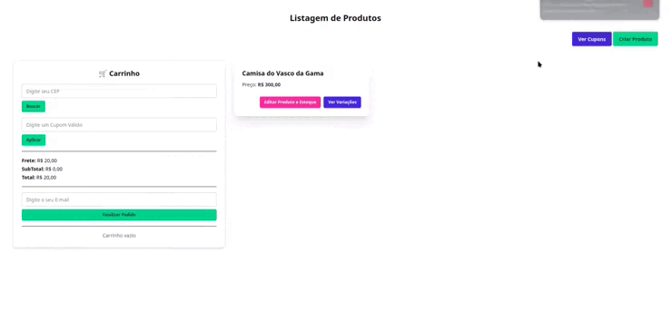

# Projeto Teste: Montink Mini ERP

## Descrição
Este projeto é um **Mini ERP** desenvolvido como teste técnico para a **Montink**, com o objetivo de simular funcionalidades básicas de um sistema de gestão de pedidos. Ele integra as operações de **produtos**, **cupons**, **pedidos** e **estoque**, incluindo regras de frete, aplicação de cupons, integração com a API ViaCEP e envio de e-mails. O sistema foi desenvolvido com **Laravel**, utilizando **MySQL** como banco de dados e executado via **Docker** para facilitar o ambiente de desenvolvimento.

## Funcionalidades Implementadas

- Cadastro e atualização de produtos com variações e controle individual de estoque.
- Carrinho via sessão com cálculo de subtotal e regras de frete:
    - Subtotal entre R$52,00 e R$166,59 → **Frete R$15,00**
    - Subtotal acima de R$200,00 → **Frete Grátis**
    - Demais casos → **Frete R$20,00**
- Aplicação de cupons com validade e valor mínimo configurável.
- Consulta automática de endereço pelo CEP via API do [ViaCEP](https://viacep.com.br/).
- Envio de e-mail ao finalizar o pedido e também ao atualizar o status (enviado ou cancelado).
- Webhook para atualização do status do pedido:
    - Se o status for `cancelado`, o pedido é marcado como cancelado no sistema.
    - Se o status for `enviado`, o pedido é marcado como enviado.

## Demonstração
<p align="start">
  
</p>

## Envio de E-mail usando mailtrap
> https://mailtrap.io/

Crie uma conta e coloque suas credenciais
```
MAIL_MAILER=log
MAIL_SCHEME=null
MAIL_HOST=127.0.0.1
MAIL_PORT=2525
MAIL_USERNAME=null
MAIL_PASSWORD=null
MAIL_FROM_ADDRESS="hello@example.com"
```

## Baixando e Inicializando o projeto com Docker
```bash
git clone git@github.com:Rei-Nicolau-o-Grande/montink-mini-erp.git
```

#### Criando o arquivo .env
```bash
cp .env.example .env
```

#### Subindo Containers Docker
```bash
./vendor/bin/sail up -d
```

#### Gerando a Key
```bash
./vendor/bin/sail artisan key:generate
```

#### Criando Tabelas no Banco de Dados e Inserindo Dados
```bash
./vendor/bin/sail artisan migrate:fresh --seed
```

#### Buildando o Projeto e Subindo
```bash
./vendor/bin/sail npm run dev
```

#### Acessando o projeto
> http://localhost/

### Tecnologias Utilizadas
- **Front-end:** HTML, Tailwind, DaisyUI 
- **Back-end:** Laravel (PHP)
- **Banco de Dados:** MySQL
- **Contêineres:** Docker

